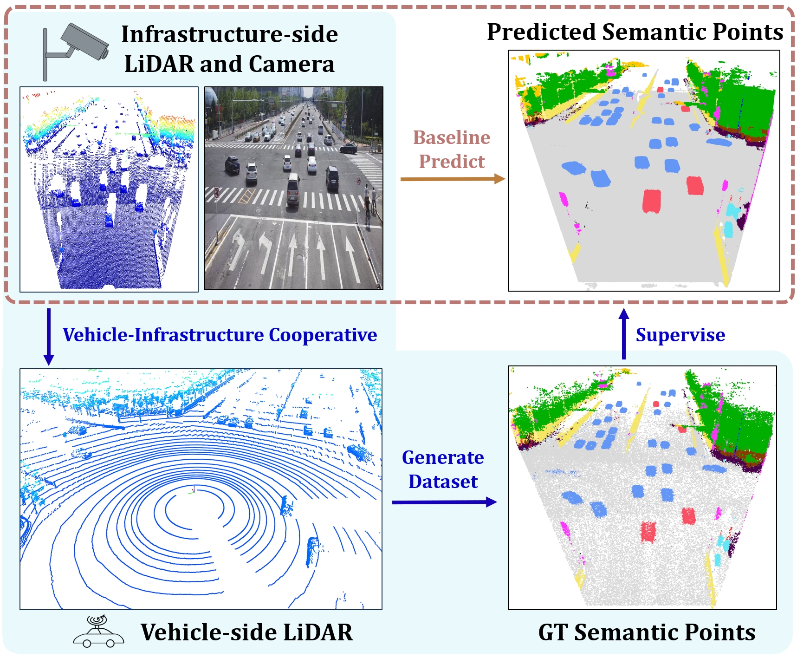
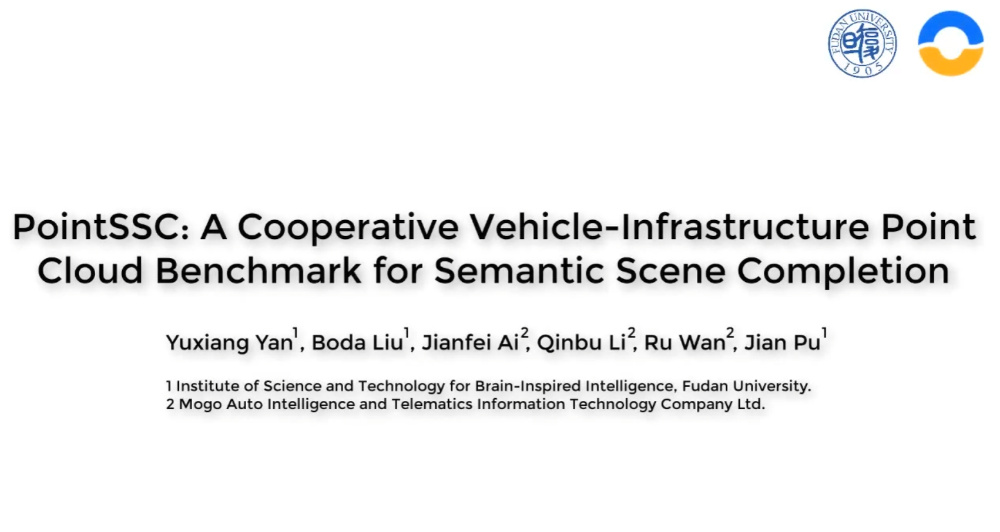
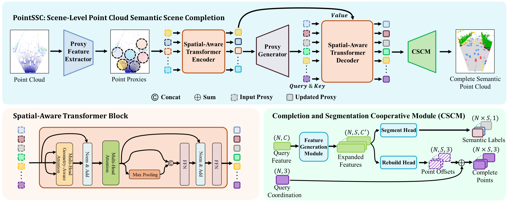
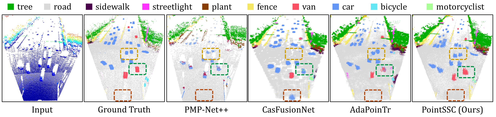

# PointSSC
## 🤖[ICRA2024] PointSSC: A Cooperative Vehicle-Infrastructure Point Cloud Benchmark for Semantic Scene Completion


We introduce **PointSSC, the first cooperative vehicle-infrastructure point cloud benchmark for semantic scene completion**. These scenes exhibit long-range perception and minimal occlusion. We develop an automated annotation pipeline leveraging Semantic Segment Anything to efficiently assign semantics. To benchmark progress, we propose a LiDAR-based model with a Spatial-Aware Transformer for global and local feature extraction and a Completion and Segmentation Cooperative Module for joint completion and segmentation. PointSSC provides a challenging testbed to drive advances in semantic point cloud completion for real-world navigation.



Our [paper](https://arxiv.org/abs/2309.12708) has been accepted by ICRA2024.

## 🎥 Video is provided as belowed.
[](https://www.youtube.com/watch?v=RZrXaJsEmyM)


## 🏁 Pre-trained checkpoint

Quantitative comparison of our models on PointSSC dataset. CD Means Chamfer Distance(Multiplied By 1000), lower is better. F1-score@0.3 means calculating by distance threshold 0.3.
| Config          | Model | CD (L1) ↓ | CD (L2) ↓ | F1-Score@0.3 ↑ |
| --------------- | ----- | --------- | --------- | -------------- |
| Time-splitting  | [Download Model](https://drive.google.com/file/d/1F9-PQSSefCRT_c7kyzIIjPAlh8Ge8QEv/view?usp=drive_link) | 208.94    | 248.28    | 81.42%         |
| Sceme-splitting | [Download Model](https://drive.google.com/file/d/1aEj2bOpJFxaNiO7Fh3MRfZiZXwqGugmr/view?usp=drive_link) | 410.92    | 1413.60   | 63.57          |


## 💻 Code Tutorial
### 📝 Requirements

- PyTorch >= 1.7.0
- python >= 3.7
- CUDA >= 9.0
- GCC >= 4.9 
- torchvision
- timm
- open3d
- tensorboardX

```
pip install -r requirements.txt
```

#### Building Pytorch Extensions for Chamfer Distance, PointNet++ and kNN

*NOTE:* PyTorch >= 1.7 and GCC >= 4.9 are required.

```bash
# Chamfer Distance
bash install.sh
```

```
# PointNet++
pip install "git+https://github.com/erikwijmans/Pointnet2_PyTorch.git#egg=pointnet2_ops&subdirectory=pointnet2_ops_lib"
# GPU kNN
pip install --upgrade https://github.com/unlimblue/KNN_CUDA/releases/download/0.2/KNN_CUDA-0.2-py3-none-any.whl
```

Note: If you still get `ModuleNotFoundError: No module named 'gridding'` or something similar then run these steps

```
    1. cd into extensions/Module (eg extensions/gridding)
    2. run `python setup.py install`
```

That will fix the `ModuleNotFoundError`.




### 📈 Evaluation

To evaluate a pre-trained AdaMemory model on the Three Dataset with single GPU, run:

```shell
python main_seg.py --test \
    --config <config> \
    --ckpts <path> \
    [--exp_name <exp_name>]
```

####  Some examples:
Test the PointSSC pretrained model on PointSSC time-splitting benchmark:
```shell
python main_seg.py --test \
    --config cfgs/V2XSeqSPD_models/PointSSC.yaml \
    --ckpts ./pretrained/pointssc_time_split.pth \
    --exp_name example
```

We also provide a multimodal PointSSC model that combines point cloud and images, relevant codes are available in ```main_seg_w_image.py```.

```shell
python main_seg_w_image.py --test \
    --config cfgs/V2XSeqSPD_SceneSplit_models/PointSSC.yaml \
    --ckpts ./pretrained/pointssc_sceme_split.pth \
    --exp_name example
```

### 🏋️‍♂️ Training

To train a point cloud completion model from scratch, run:

```shell
# Use DistributedDataParallel (DDP)
bash ./scripts/dist_train_seg.sh <NUM_GPU> <port> \
    --config <config> \
    --exp_name <name> \
    [--resume] \
    [--start_ckpts <path>] \
    [--val_freq <int>]
```

####  Some examples:
Train a PointSSC model on with 4 gpus:
```shell
CUDA_VISIBLE_DEVICES=0,1,2,3 bash ./scripts/dist_train_seg.sh 4 13232 --config ./cfgs/V2XSeqSPD_models/PointSSC.yaml --exp_name example
```
Resume a checkpoint:
```shell
CUDA_VISIBLE_DEVICES=0,1,2,3 bash ./scripts/dist_train_seg.sh 4 13232 --config ./cfgs/V2XSeqSPD_models/PointSSC.yaml --exp_name example --resume
```



## 🗃️ Dataset Tutorial
The PointSSC dataset is further developed based on the V2X-Seq dataset (https://thudair.baai.ac.cn/coop-forecast). The raw images and partial point cloud data can be directly obtained from the official website of the V2X-Seq dataset, and our link only contains the GT PointSSC labels.

Due to insufficient cloud storage space, I have provided a [PointSSC-Example file](https://drive.google.com/file/d/18GufPjIN80PdjM2VGIqqwFWa8I5-Gmia/view?usp=drive_link) on Google Drive. If you need the full dataset (approximately 32GB), please email me, and I will provide you with a personal data transfer link via [Alibaba Cloud Drive](https://www.alipan.com/).

It should be noted that due to the inertia during vehicle movement, there are some calibration errors in the on-board sensors of the V2X-Seq data collection vehicle, especially when the vehicle is turning, where the extrinsic sensor calibration errors are more prominent. These errors can lead to ghosting and artifacts during the temporal stitching of point cloud data. We have attempted to use point cloud registration algorithms for correction, but the results were not ideal. Therefore, we have adopted a random sampling approach to mitigate this issue as much as possible.

The final data root should be like
```
V2X-Seq-SPD
├── scene_split
│   ├── train.pkl
│   └── test.pkl
├── time_split
│   ├── train.pkl
│   └── test.pkl
└── V2X-Seq-SPD
    ├── vehicle-side
    ├── completion_data (PointSSC provided)
    ├── cooperative
    └── infrastructure-side
```

## 📜 License
MIT License

## 🙏 Acknowledgements

Some of the code of this repo is borrowed from: 
- [PCN](https://github.com/wentaoyuan/pcn/tree/master)
- [SnowFlakeNet](https://github.com/AllenXiangX/SnowflakeNet/tree/main)
- [PoinTr](https://github.com/yuxumin/PoinTr)
- [ChamferDistancePytorch](https://github.com/ThibaultGROUEIX/ChamferDistancePytorch)


We thank the authors for their great job!
